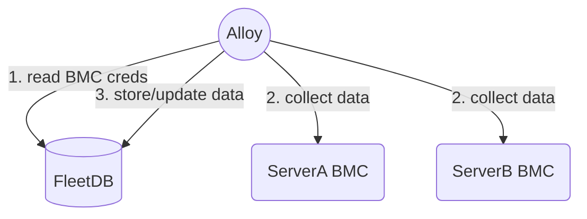
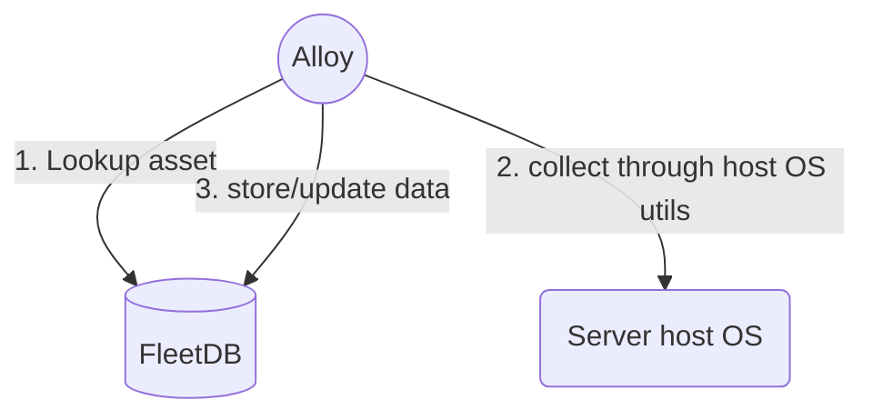

## Alloy

Alloy collects and stores server hardware inventory and bios configuration data.

Hardware inventory includes information on the hardware components present on a server,
the firmware versions installed and the component health status.

Inventory collection with Alloy can be executed in two modes,
 - `In band` - the alloy command is executed on the target host OS.
 - `Out of band` - the alloy command is executed on a remote system that can reach the target BMC.


### Build

a. build linux executable
`make build-linux`

b. build osx executable
`make build-osx`

#### Run - `outofband`

Assets are fetched from a store, this is defined by the by the `-store` flag,
the accepted `-store` flag parameters are `csv`, `fleetdb`, `mock`.

for see [examples](examples/assets.csv).

##### `FleetDB` store



For this store, Alloy expects `fleetdb` credentials and configuration,
this can be set through env vars, for an example see [fleetdbapi.env](./examples/fleetdbapi.env)

1. Collect data for asset in `fleetdb` inventory store, dump collected data to stdout.

```
alloy outofband --store fleetdb --asset-ids <FleetDB asset ID>  --output-stdout
```

2. Collect data for asset in `fleetdb` inventory store, update `fleetdb` with the collected information.
```
alloy outofband --store fleetdb --asset-ids <FleetDB asset ID>
```

##### `CSV` store

The CSV store is an sample inventory store implementation, that can be used to collect data on assets
listed in the csv, without having to run `fleetdb`.

Note: this store is only supported for `outofband` commands.

```
alloy outofband --store csv --csv-file ./examples/assets.csv  --asset-ids 6b8a090c-39f0-4c45-89e1-041044d27402 --log-level trace --output-stdout
```

#### Run - `inband`

Inband inventory collection requires various OS based utilites provided by [ironlib](https://github.com/metal-toolbox/ironlib) docker image.





```
alloy inband --store fleetdb --asset-id <FleetDB server ID> --log-level trace
```

### Metrics and traces

Go runtime and Alloy metrics are exposed on `localhost:9090/metrics`.

Telementry can be collected by setting env variables to point to the
opentelemetry collector like Jaeger.

```
export OTEL_EXPORTER_OTLP_ENDPOINT=jaeger:4317
export OTEL_EXPORTER_OTLP_INSECURE=true
```

### Alloy commands

```
❯ ./alloy
server inventory and bios configuration collector

Usage:
  alloy [command]

Available Commands:
  completion  Generate the autocompletion script for the specified shell
  help        Help about any command
  inband      Collect inventory data, bios configuration data on the host
  outofband   Collect inventory data, bios configuration data through the BMC
  version     Print Alloy version along with dependency - ironlib, bmclib version information.

Flags:
      --config string      configuration file
      --enable-pprof       Enable profiling endpoint at: localhost:9091
  -h, --help               help for alloy
      --log-level string   set logging level - debug, trace (default "info")
      --output-stdout      Output collected data to STDOUT instead of the store
      --store string       The inventory store kind (fleetdb, csv) (default "mock")

Use "alloy [command] --help" for more information about a command.
```

### Development

For Alloy internals and development, checkout the [README-development.md](docs/README-development.md)
