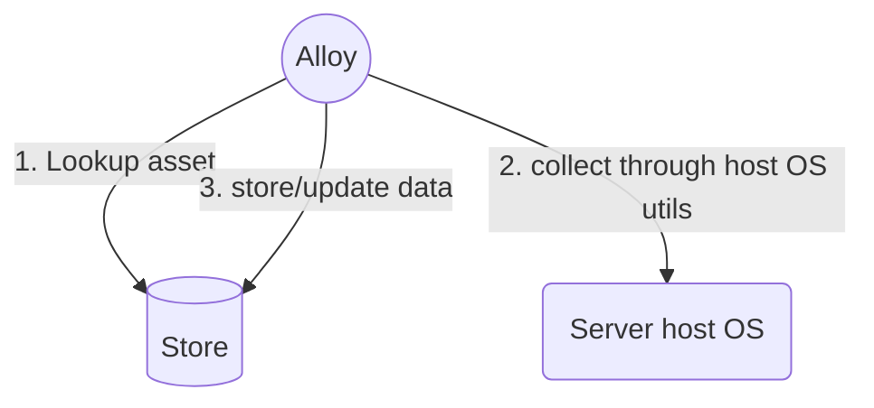
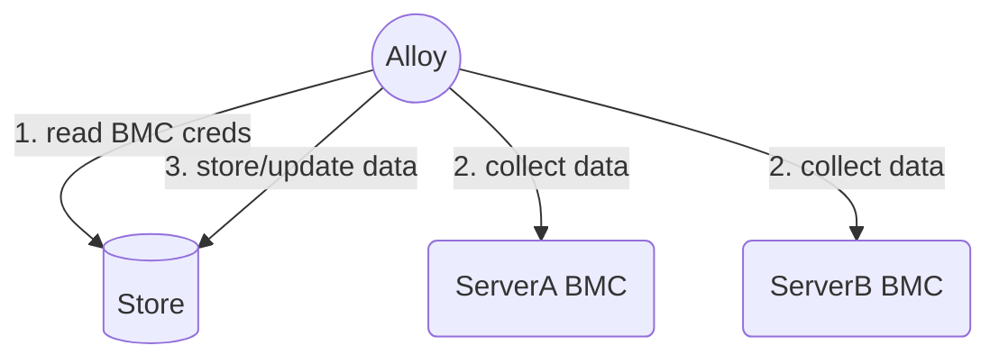

### Alloy software components

Check out the [sandbox](https://github.com/metal-toolbox/sandbox) repository to run Alloy along with Serverservice.

Alloy is internally composed of two main components the `Collector` and the `Controller`,
the store is a backend repository of inventory assets.

#### Collector

The `Collector` listens for devices on the asset channel (from the asset iterator),
and proceeds to collect inventory, bios configuration for the devices received.

#### Controller

TODO: explain controller bits, the asset iterator is split out as the Alloy scheduler.


###### In band collection

In band inventory is collected when alloy is invoked with the `inband` command,
this calls into the [ironlib](https://github.com/metal-toolbox/ironlib) library
which abstracts the hardware/vendor specific data collection through a host OS.



###### Out of band collection

Out of band inventory is collected when Alloy is invoked with the `out of band`
command, which calls into the [bmclib](https://github.com/bmc-toolbox/bmclib/)
library, which abstracts hardware/vendor specific data collection remotely through the
BMC.




#### Debugging/fixture dump environment variables

 Set `DEBUG_DUMP_FIXTURES=true` to have fixture data for `fixtures/device.go`, `fixtures/serverservice_components.*` dumped,
 the objects are dumped to files in the current directory,
 ```
fc167440-18d3-4455-b5ee-1c8e347b3f36.device.fixture             # the device object returned from ironlib/bmclib
fc167440-18d3-4455-b5ee-1c8e347b3f36.current.components.fixture # the current component data from server service
fc167440-18d3-4455-b5ee-1c8e347b3f36.new.components.fixture     # the newer component data based on the device object from ironlib/bmclib
 ```

 Set `DEBUG_DUMP_DIFFERS=true` to have object differ changelogs from the `publish.CreateUpdateServerComponents()` method dumped.


#### Signed commits

The Alloy repository requires signed commits which are attested via [sigstore](https://www.sigstore.dev/).
To enable that on your development machine, you need to install [gitsign](https://github.com/sigstore/gitsign)
and enable commit signing with it for this repository:

```bash
cd /path/to/this/repository
git config --local commit.gpgsign true  # Sign all commits
git config --local tag.gpgsign true  # Sign all tags
git config --local gpg.x509.program gitsign  # Use gitsign for signing
git config --local gpg.format x509  # gitsign expects x509 args
```
