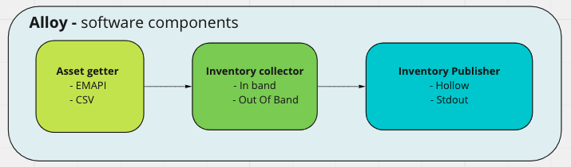
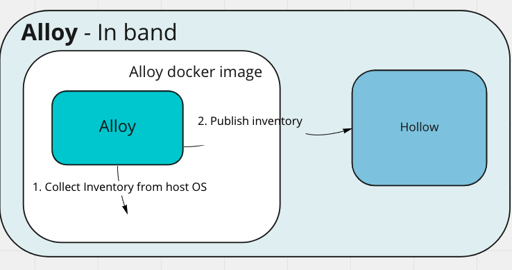
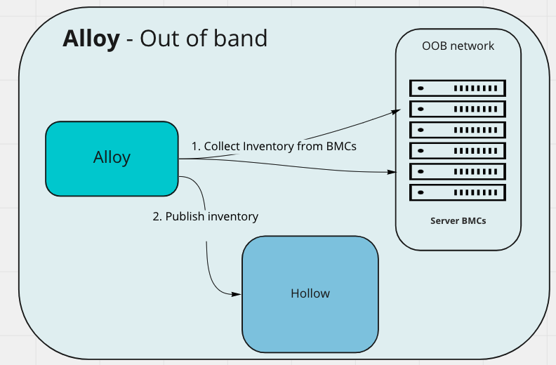

### Alloy software components

Alloy is internally composed of three main components,
the `Asset getter`, `Inventory collector` and `Inventory publisher`.



#### Asset getter

The asset getter (only) runs in the `Out of band` mode  - that is when,
Alloy is invoked with the `outofband` command and BMC credentials are required
for remote inventory collection.

The assets getter then sends the assets it retrieved as `model.Asset`
on the `asset channel`, for the `Inventory collector` component.

Asset getters implement the `Getter` interface, at the time of writing
Alloy comes with a `CSV` and an `EMAPI` asset getter.

#### Inventory collector

The `Inventory collector` listens for devices on the asset channel (from the asset getter),
and proceeds to collect inventory for the devices received - through `In band` or `Out of band`.

The collector then sends the collected inventory as an `model.AssetDevice` on the
`collector channel`, for the `Inventory publisher` component.

Inventory collectors implement the `Collector` interface.

###### In band collection

In band inventory is collected when alloy is invoked with the `inband` command,
this calls into the [ironlib](https://github.com/metal-toolbox/ironlib) library
which abstracts the hardware/vendor specific data collection through a host OS.




###### Out of band collection

Out of band inventory is collected when Alloy is invoked with the `out of band`
command, which calls into the [bmclib](https://github.com/bmc-toolbox/bmclib/)
library, which abstracts hardware/vendor specific data collection remotely through the
BMC.




#### Inventory publisher

The `Inventory publisher` listens for asset devices from the inventory collector,
and proceeds to transform the data for publishing, and then publishes the data.

Inventory publishers implement the `Publisher` interface.

#### Debugging/fixture dump environment variables

 Set `DEBUG_DUMP_FIXTURES=true` to have fixture data for `fixtures/device.go`, `fixtures/serverservice_components.*` dumped,
 the objects are dumped to files in the current directory,
 ```
fc167440-18d3-4455-b5ee-1c8e347b3f36.device.fixture             # the device object returned from ironlib/bmclib
fc167440-18d3-4455-b5ee-1c8e347b3f36.current.components.fixture # the current component data from server service
fc167440-18d3-4455-b5ee-1c8e347b3f36.new.components.fixture     # the newer component data based on the device object from ironlib/bmclib
 ```

 Set `DEBUG_DUMP_DIFFERS=true` to have object differ changelogs from the `publish.CreateUpdateServerComponents()` method dumped.